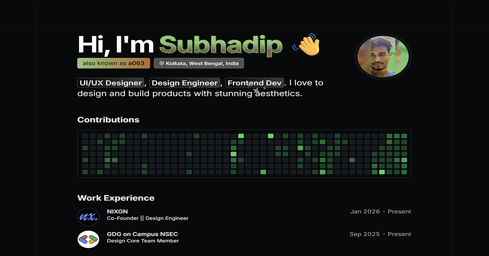

# Subhadip Jana(a063) Portfolio



A modern, minimal, and developer-centric portfolio website built with **Next.js 14**, **TypeScript**, and **Tailwind CSS**. Designed to showcase projects, skills, and thoughts in a clean and efficient manner.

## 🚀 Overview

This portfolio is engineered for performance and ease of customization. It features a sleek design with dark/light mode support, a dynamic blog system powered by MDX, and a fully responsive layout. Data is separated from the UI, making it incredibly easy to adapt for your own use.

## ✨ Key Features

- **🎨 Modern Design**: Clean aesthetics with a focus on typography and whitespace.
- **🌙 Dark/Light Mode**: Seamless theme switching with system preference detection.
- **📱 Fully Responsive**: Optimized for all devices, from mobile phones to high-res desktops.
- **📝 MDX Blog**: Write articles using Markdown/MDX with syntax highlighting via `shiki`.
- **⚡ High Performance**: Built on Next.js 14 (App Router) for optimal speed and SEO.
- **📊 GitHub Integration**: Visualize contributions with a custom GitHub calendar component.
- **🔧 Easy Customization**: All content (experience, projects, social links) is managed via a single config file (`src/data/resume.tsx`).

## 🛠️ Tech Stack

- **Framework**: [Next.js 14](https://nextjs.org/)
- **Language**: [TypeScript](https://www.typescriptlang.org/)
- **Styling**: [Tailwind CSS](https://tailwindcss.com/)
- **Animation**: [Framer Motion](https://www.framer.com/motion/)
- **Icons**: [Lucide React](https://lucide.dev/)
- **UI Components**: [Radix UI](https://www.radix-ui.com/) & [Shadcn UI](https://ui.shadcn.com/)
- **Content**: MDX, Rehype, Remark

## 🏃‍♂️ Getting Started

Follow these steps to get the project up and running locally.

### Prerequisites

- Node.js (v18 or higher)
- npm or pnpm

### Installation

1. **Clone the repository**
   ```bash
   git clone https://github.com/Subhadipjana95/Dev-Style_Portfolio.git
   cd Dev-Style_Portfolio
   ```

2. **Install dependencies**
   ```bash
   npm install
   # or
   pnpm install
   ```

3. **Start the development server**
   ```bash
   npm run dev
   # or
   pnpm dev
   ```

4. **View in browser**
   Open [http://localhost:3000](http://localhost:3000) to see the application.

## 📝 Customization

### Personal Data
Update the `src/data/resume.tsx` file to change:
- Personal Information (Name, Title, Location)
- Social Media Links
- Work Experience
- Education History
- Skills List
- Project Details

### Blog Posts
Add new articles by creating `.mdx` files in the `content` directory. The system automatically routes and renders them.

## 📦 Building for Production

To create an optimized production build:

```bash
npm run build
npm start
```

## 📄 License

This project is open sourced under the [MIT License](LICENSE.txt).

---

Created by [Subhadip Jana](https://github.com/Subhadipjana95).
